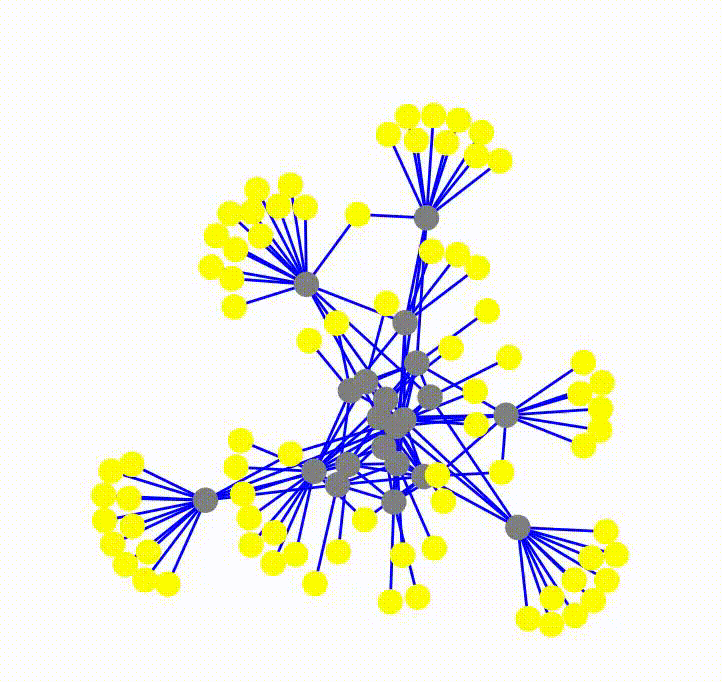
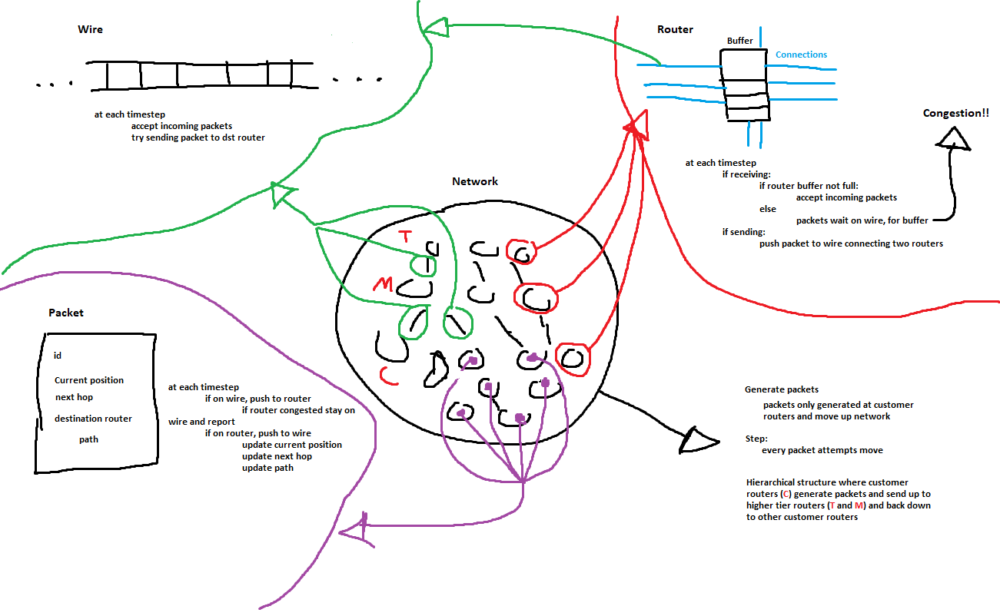
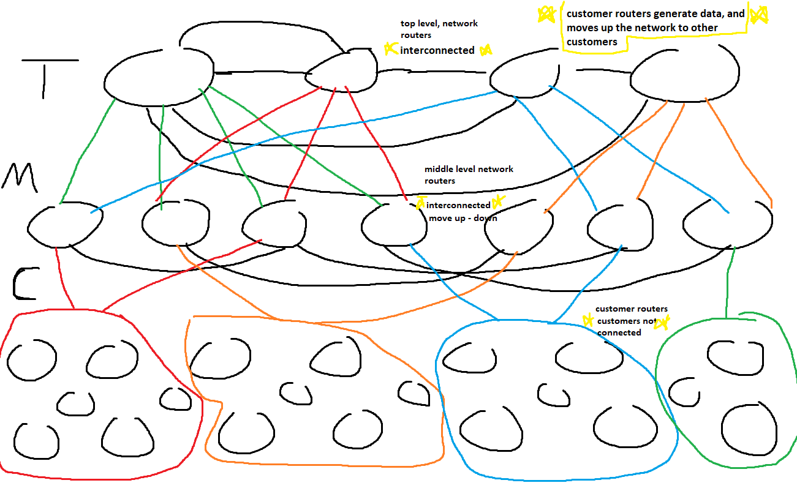

## Congestion RL environment

## Requirements

- python 3.10
- pytorch 1.13
- matplotlib
- Networkx
- numpy
- opencv

## How To Run

- Clone repo, install dependancies
- run env.py to start simulation
- alternatively use the jupyter notebook for environment

## Architecture Diagrams

